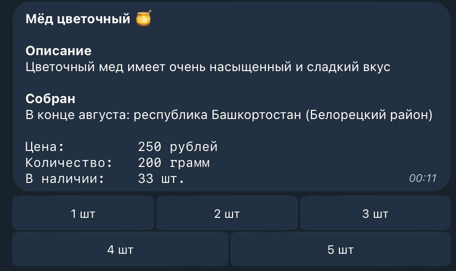
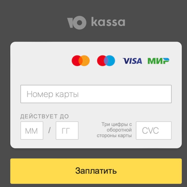
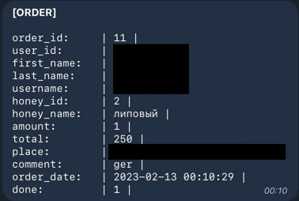

# HoneyBot 🍯

## Tools
&nbsp;
&nbsp;
&nbsp;

Telegram Bot - AIOGram
## Description

### Users
✅ User can top up the balance by entering the card.  
✅ User can make purchases, specify the address and comment on the order

### Admins
✅ Admins can receive a list of orders and set their status  
✅ Admins can insert data into the database, change data, etc.

## Examples

### Honey list

### Deposit

### Create order

↓  

↓  

↓  

### Order

